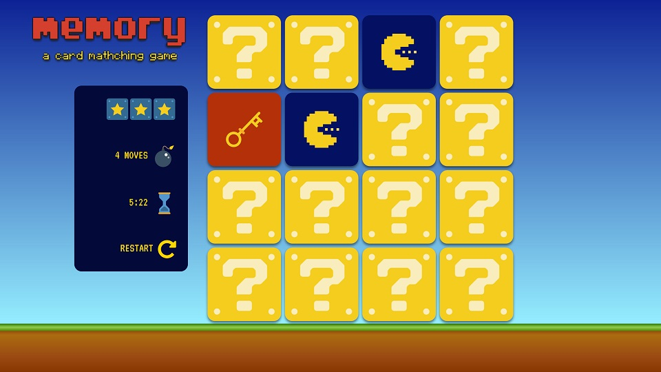

# Memory Card Game

### Description & Motivation

This is the second required project on the [Udacity Front End Nanodegree](https://eu.udacity.com/course/front-end-web-developer-nanodegree--nd001).

This project was really challenging! It tested all my JavaScript knowledge -- and definitely all my Google/StackOverflow searching skills. At first I was overwhelmed and didn't even know where to start, but I found writing pseudocode and breaking each to-do into a really small task helped. For the first time I made use of Github Issues and Github Projects to track my progress and I will definitely keep on using both, even as a sole developer.

Initially I built this project using the starting files provided by Udacity, and just customized the CSS a little. However, once the project was done, I felt it looked a bit too generic. It didn't reflect myself or the kind of project I want to showcase on my portfolio. So I planned a redesign, using old 90s games as inspiration (mostly Super Mario World and Donkey Kong).

### Project requirements

[https://review.udacity.com/#!/rubrics/591/view](https://review.udacity.com/#!/rubrics/591/view)

### Tech/framework used

Made with:

* HTML
* CSS custom styles
* CSS Grid
* JavaScript

Credits:

* Logo generated with [Textcraft](https://textcraft.net/)
* Icons courtesy of [smashicons](https://www.flaticon.com/authors/smashicons) from [www.flaticon.com](https://www.flaticon.com/)
* Modal tutorial by [W3 Schools](https://www.w3schools.com/howto/howto_css_modals.asp)

### Demo and usage

Live demo: [curved-transport.surge.sh](http://curved-transport.surge.sh/)

The game was tested on Chrome, Firefox and Edge.
It has no support for IE, because I am using newer ES6 features (such as template literals) and CSS Grid for layout.

